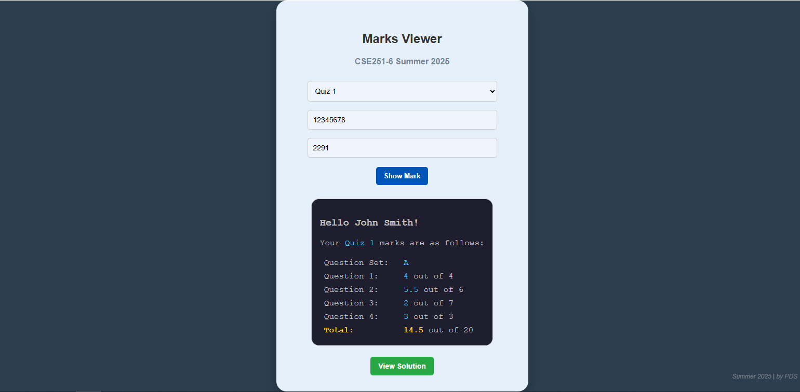
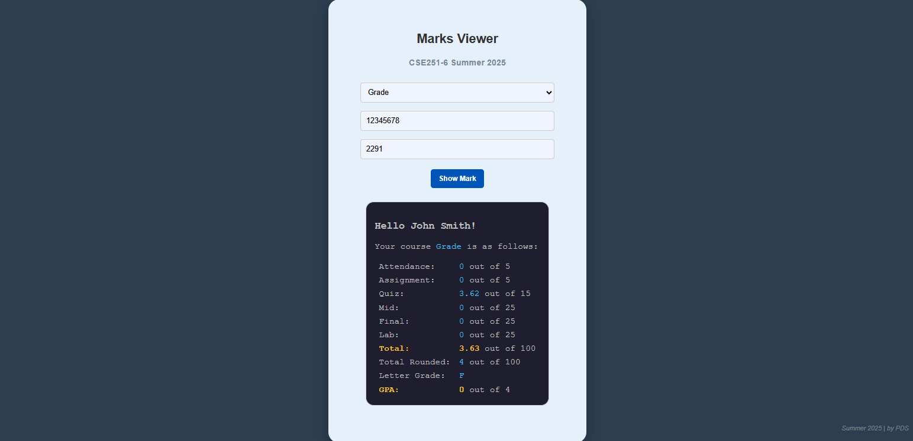
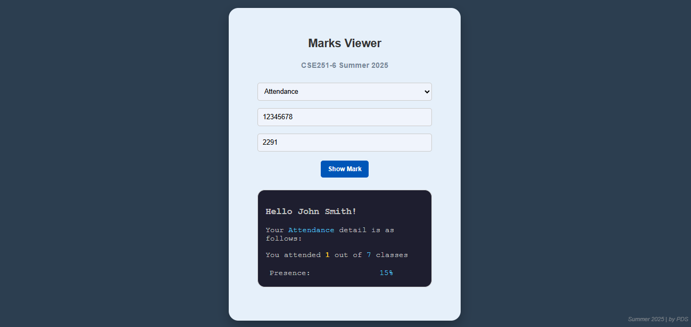

# Student Marks Viewer

**Student Marks Viewer** is a secure web application built using **Google Apps Script** that allows students to view their assessment marks and solution links through a user-friendly web interface. Each student uses a **unique access code** (sent via email once) and their **Student ID** to securely access their results stored in a **Google Sheet**.

# Key Features

- 🔐 **Secure access** using **Student ID** and a **Unique Code**
- 📋 **Dropdown to select assessments** (e.g., Quiz 1, Midterm, Final, Grades, etc.)
- ✅ **Selective publishing**:
  - Choose **which assessments** to publish or keep hidden
  - Within an assessment, choose **which marks** to show (e.g., hide class average or certain questions)
- 📊 **View individual marks** for selected assessments
- 📘 **"View Solution"** button (if available) to access solutions for published assessments
- 🧾 **Easy data management** via Google Sheets
- 🎨 **Clean, responsive interface** (HTML/CSS) — mobile-friendly
- 💡 **Teacher-managed & serverless** via Google Apps Script

---

## 📁 Project Structure

```yaml
Student-Marks-Viewer/
├── Code.gs # Google Apps Script backend logic
├── index.html # Frontend user interface
├── style.html # Embedded CSS styling
└── README.md # Documentation
```
---

## 🔗 Setup Instructions

### 1. 📄 Copy the Google Sheet Template

👉 [Click here to open the Blank Sheet Template](https://docs.google.com/spreadsheets/d/19rNr-BRpQWBltKCmNdtYA6bVGSO1ozm7uoRcXQZbxh0/edit?usp=sharing)

- Go to **File > Make a copy** to create your own version.
  - > Set the privacy of the spreadsheet to `Public`. 
- Copy the **Sheet ID** from the URL:  

### 2. 🔧 Set Up Apps Script

1. Open [Google Apps Script](https://script.google.com/).
2. Create a new project.
3. Replace `Code.gs` with the backend script.
4. Add `index.html` and `style.html` as HTML files and copy and paste the script.

### 3. 🔁 Configure Project Variables in `Code.gs`

Open `Code.gs` and update:

```js
template.course = "CSE250"; // update course

template.semester = "Summer 2025"; // update semester

template.section = "4, 19"; //update section

const markSpreadsheetId = "16phH4jPzbAORLxOTZTGB..."; // update your sheet Id here
```
---

## 📊 Google Sheet Guide

To ensure smooth operation, follow this strict format for each sheet/tab (one tab per assessment).

### ✅ Fixed Rows and Columns (Do NOT remove or add in between)

| ✔ | SL | ID | Name | Email |
|:---------:|:--:|:--:|:----:|:-----:|
| Section   |    |    |      |       |
|           |    |    |      |       |

### ✅ Marks Columns (Add or remove)

| Set | Question 1 | Question 2 | Total | Solution |
|:---:|:----------:|:----------:|:-----:|:--------:|
|     |    CO1     |    CO2     |       |          |
|     | 8 Marks    | 12 Marks   | 20 Marks | https://driv... |
|  A  |     6      |     9      |   15  |      |

### ➕ Adding New Assessments

1. Duplicate an existing **sheet/tab** to add a new assessment:
   - Sheet names should match dropdown items (e.g., `Quiz 1`, `Mid`, `Final`, `Grade`).
2. Maintain the column structure:
   - Fixed columns are `✔ / Section`, `SL`, `ID`, `Name`, and `Email`
3. The following columns after `Email` are the marks columns that will be published.
4. If you don't want to publish an assessment, change `✔` to `✘` in the cell `A1`.
5. > **IMPORTANT:** If you don't want to publish a column (after `Email` column) within an assignment, remove the header content or include a `~` symbol anywhere in the header content.
   > Any columns with a **blank header** or inclusion of `~` symbol in will **not** be published.
6. Add the new assessment as an option to the dropdown menu in the `index.html` file.


### ⚠️ Do Not

- ❌ Delete the first five columns (`✔ / Section`, `SL`, `ID`, `Name`, and `Email`)
- ❌ Delete the first three rows

### 📁 Example Sheet (Quiz 1)

| ✔ | SL | ID       | Name       | Email               | Set | Question 1 | Question 2 | Total    | Solution            |
|:---------:|:--:|:--------:|:----------:|:-------------------:|:--:|:----------:|:----------:|:--------:|:-------------------:|
| Section   |    |          |            |                     |    |    CO1     |    CO2     |          |                     |
|           |    |          |            |                     |    | 8 Marks    | 12 Marks   | 20 Marks | https://drive.link1 |
|     6     |  1 | 12345678 | John Smith | john@example.com    |  A |     6      |     9      |   15     |                     |
|     6      |  2 | 87654321 | Jane Doe   | jane@example.com    |  B |     8      |    10      |   18     |                     |

## 🖼️ Sample Screenshots








## ✅ Deployment Steps

1. Open the [Google Apps Script Editor](https://script.google.com/).
2. Create a new project and paste the contents of:
   - `Code.gs` into the script editor
   - `index.html` and `style.html` as new HTML files
3. Replace the placeholder `course`, `semester`, `section`, and `markSpreadsheetId` in `Code.gs` with your actual values.
4. Go to **Deploy > Manage Deployments > New Deployment**
5. Choose **"Web app"** as the deployment type.
6. Set the deployment configuration:
   - **Execute as**: *Me*
   - **Who has access**: *Anyone*
7. Click **Deploy** and copy the **web app URL**.
8. Share the link with students (along with their unique codes).

---

## 👨‍🎓 Student Usage Flow

1. Open the shared web app URL.
2. Use the **dropdown menu** to select an assessment (e.g., `Quiz 1`, `Mid`, `Final`, `Attendance`, `Assignment`, and `Grade`).
3. Enter:
   - Their **Student ID**
   - Their **Unique Code** (provided by the instructor)
4. Click **"Show Mark"**.
5. The page will display:
   - The **mark** for that assessment.
   - A **"View Solution"** button (if a solution link is available).

> ⚠️ **Note:** If marks don't appear instantly, please be patient and try clicking the **"Show Mark"** button again after a few seconds.  
> This can occasionally happen due to high load or multiple simultaneous accesses to the spreadsheet.

---

## 📧 Distribution Plan

At the beginning of the semester:

- Email each student the following information:
  - 📌 Their **Unique Code** (keep it secret)
  - 🌐 The **Web App Link**

Remind students to **keep their code confidential** and use the same credentials throughout the semester to check their marks and solutions.

---

## 📝 Tips

- ✅ Make sure each assessment tab in your Google Sheet follows the format:
  `Publish ✔ / Section | SL | ID | Name | Email`
- 🔒 Use random unique codes (any number of characters) for each student.
- 🛡️ For extra security:
  - Use CAPTCHA integration
  - Rate-limit access using Apps Script logic
> - 🚫 Never share the raw Google Sheet with students; access should only be via the web app.
- 🔁 You can regenerate or revoke a student’s access anytime by changing or deleting their code in the sheet.

## 🙋 Author

**Purbayan Das (PDS)**  
Instructor & Developer

Feel free to fork the project, open issues, or contribute improvements!

---

## 📄 License

This project is licensed under the **MIT License**.  
See the [LICENSE](LICENSE) file for full details.
