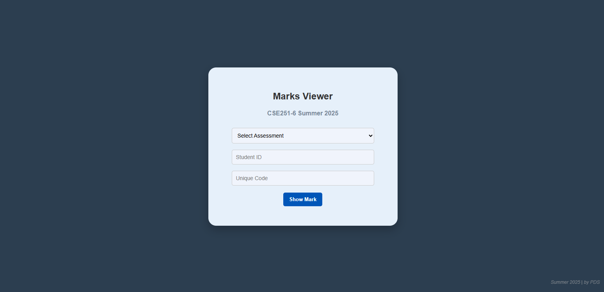
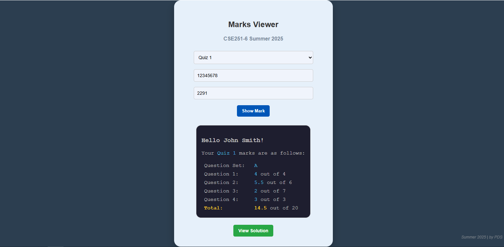
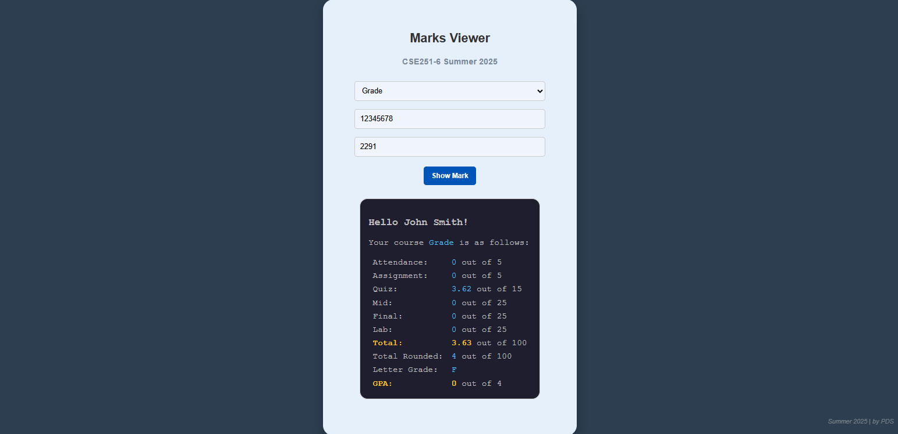

# Student Marks Viewer

**Student Marks Viewer** is a secure web application built using **Google Apps Script** that allows students to view their assessment marks and solution links through a user-friendly web interface. Each student uses a **unique access code** (sent via email once) and their **Student ID** to securely access their results stored in a linked **Google Sheet**.

## 🚀 Features

- 🔐 Secure access using **Student ID** and **Unique Code**
- 📋 Dropdown to select an assessment (Quiz 1, Mid, Final, Grade, etc.)
- 📊 View individual **marks** for selected assessments
- 📘 **"View Solution"** button for assessments (if avalable) to see question solutions
- 🧾 Data managed easily via Google Sheets
- 🎨 Clean and mobile-friendly interface (HTML/CSS)
- 💡 Teacher-managed & serverless deployment via Apps Script

---

## 📁 Project Structure

```yaml
Student-Marks-Viewer/
├── Code.gs # Google Apps Script backend logic
├── index.html # Frontend user interface
├── style.html # Embedded CSS styling
└── README.md # Documentation
```
---

## 🔗 Setup Instructions

### 1. 📄 Copy the Google Sheet Template

👉 [Click here to open the Blank Sheet Template](https://docs.google.com/spreadsheets/d/1W_ZZ2X2_TEMPLATE_SHEET_ID_HERE/edit?usp=sharing)

- Go to **File > Make a copy** to create your own version.
- Copy the **Sheet ID** from the URL:  

### 2. 🔧 Set Up Apps Script

1. Open [Google Apps Script](https://script.google.com/).
2. Create a new project.
3. Replace `Code.gs` with your backend script.
4. Add `index.html` and `style.html` as HTML files and copy paste script.

### 3. 🔁 Configure Project Variables in `Code.gs`

Open `Code.gs` and update:

```js
template.course = "CSE251"; // update course

template.semester = "Summer 2025"; // update semester

template.section = 6; //update section

const markSpreadsheetId = "16phH4jPzbAORLxOTZTGB"; // update your sheet Id here
```
---

## 📊 Google Sheet Guide

To ensure smooth operation, follow this strict format for each sheet/tab (one tab per assessment).

### ✅ Fixed Rows and Columns (Do NOT remove or add in between)

| Publish ✔ | SL | ID | Name | Email |
|:---------:|:--:|:--:|:----:|:-----:|
| Section   |    |    |      |       |
|           |    |    |      |       |

### ✅ Marks Columns (Add or remove)

| Set | Question 1 | Question 2 | Total | Solution |
|:---:|:----------:|:----------:|:-----:|:--------:|
|     |    CO1     |    CO2     |       |          |
|     | 8 Marks    | 12 Marks   | 20 Marks | https://driv... |
|  A  |     6      |     9      |   15  |      |

### ➕ Adding New Assessments

1. Create a **new sheet/tab** in the same Google Sheet for each assessment:
   - Sheet names should match dropdown items (e.g., `Quiz 1`, `Mid`, `Final`, `Grade`).
2. Maintain the column structure:
   - Start with `Publish ✔ / Section`, `SL`, `ID`, `Name`, `Email`
3. Next columns after `Email` are the marks columns that will be published. Set as you want.
4. > **IMPORTANT:** If you don't want to publish a column within the marks section, just remove the header content (the cell in row 1).  
   > Any columns with a **blank header** in row 1 will **not** be published.


### ⚠️ Do Not

- ❌ Delete or rename the first five columns (`Publish ✔ / Section`, `SL`, `ID`, `Name`, `Email`)
- ❌ Make the sheet public or share the with students **without notifying** — it should only be accessed by Apps Script.

### 📁 Example Sheet (Quiz 1)

| Publish ✔ | SL | ID       | Name       | Email               | Set | Question 1 | Question 2 | Total    | Solution            |
|:---------:|:--:|:--------:|:----------:|:-------------------:|:--:|:----------:|:----------:|:--------:|:-------------------:|
| Section   |    |          |            |                     |    |    CO1     |    CO2     |          |                     |
|           |    |          |            |                     |    | 8 Marks    | 12 Marks   | 20 Marks | https://drive.link1 |
|     6     |  1 | 12345678 | John Smith | john@example.com    |  A |     6      |     9      |   15     |                     |
|     6      |  2 | 87654321 | Jane Doe   | jane@example.com    |  B |     8      |    10      |   18     |                     |

## 🖼️ Sample Screenshots







## ✅ Deployment Steps

1. Open the [Google Apps Script Editor](https://script.google.com/).
2. Create a new project and paste the contents of:
   - `Code.gs` into the script editor
   - `index.html` and `style.html` as new HTML files
3. Replace the placeholder `course`, `semester`, `section`, and `markSpreadsheetId` in `Code.gs` with your actual values.
4. Go to **Deploy > Manage Deployments > New Deployment**
5. Choose **"Web app"** as the deployment type.
6. Set the deployment configuration:
   - **Execute as**: *Me*
   - **Who has access**: *Anyone*
7. Click **Deploy** and copy the **web app URL**.
8. Share the link with students (along with their unique codes).

---

## 👨‍🎓 Student Usage Flow

1. Open the shared web app URL.
2. Use the **dropdown menu** to select an assessment (e.g., `Quiz 1`, `Mid`, `Final`).
3. Enter:
   - Their **Student ID**
   - Their **Unique Code** (provided by the instructor)
4. Click **"View Result"**.
5. The page will display:
   - The **mark** for that assessment.
   - A **"View Solution"** button (if a solution link is available).

---

## 📧 Distribution Plan

At the beginning of the semester:

- Email each student the following information:
  - 📌 Their **Unique Code** (keep it secret)
  - 🌐 The **Web App Link**

Remind students to **keep their code confidential** and use the same credentials throughout the semester to check their marks and solutions.

---

## 📝 Tips

- ✅ Make sure each assessment tab in your Google Sheet follows the format:
  `Publish ✔ / Section | SL | ID | Name | Email`
- 🔒 Use random unique codes (any number of characters) for each student.
- 🛡️ For extra security:
  - Use CAPTCHA integration
  - Rate-limit access using Apps Script logic
> - 🚫 Never share the raw Google Sheet with students; access should only be via the web app.
- 🔁 You can regenerate or revoke a student’s access anytime by changing or deleting their code in the sheet.

## 🙋 Author

**Purbayan Das (PDS)**  
Instructor & Developer

Feel free to fork the project, open issues, or contribute improvements!

---

## 📄 License

This project is licensed under the **MIT License**.  
See the [LICENSE](LICENSE) file for full details.
